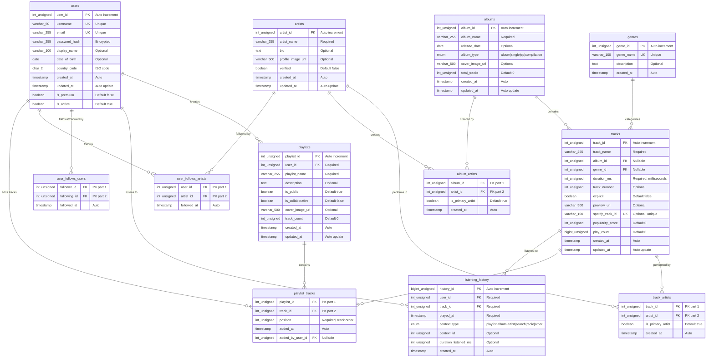

# Spotify Database - Entity Relationship Diagram

This document contains the Mermaid ER diagram for the Spotify-like database schema.

## Full ER Diagram

## Relationship Summary

### One-to-Many Relationships

1. **users → playlists**: One user creates many playlists
2. **users → listening_history**: One user has many listening records
3. **albums → tracks**: One album contains many tracks
4. **genres → tracks**: One genre categorizes many tracks
5. **users → playlist_tracks** (via `added_by_user_id`): One user adds many tracks to playlists

### Many-to-Many Relationships

1. **tracks ↔ artists** (via `track_artists`): Tracks can have multiple artists, artists can have multiple tracks
2. **albums ↔ artists** (via `album_artists`): Albums can have multiple artists, artists can have multiple albums
3. **playlists ↔ tracks** (via `playlist_tracks`): Playlists contain multiple tracks, tracks can be in multiple playlists
4. **users ↔ artists** (via `user_follows_artists`): Users can follow multiple artists, artists can be followed by multiple users
5. **users ↔ users** (via `user_follows_users`): Users can follow multiple users, users can be followed by multiple users

## Cardinality Notation

- `||--o{` : One-to-Many (one on left, many on right)
- `}o--||` : Many-to-One (many on left, one on right)
- `}o--o{` : Many-to-Many (via junction table)

## Key Symbols

- **PK**: Primary Key
- **FK**: Foreign Key
- **UK**: Unique Key
- **Auto**: Automatically set (DEFAULT CURRENT_TIMESTAMP)
- **Auto update**: Automatically updated (ON UPDATE CURRENT_TIMESTAMP)
