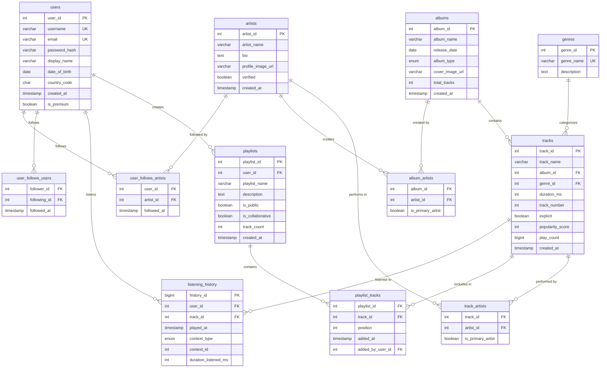

# Spotify-like Database Schema

A comprehensive relational database schema designed to model a music streaming platform similar to Spotify. This schema includes core entities, relationships, and indexes optimized for production use.

---

## 📋 Table of Contents

- [Overview](#overview)
- [Entity Relationship Diagram](#entity-relationship-diagram)
- [Schema Structure](#schema-structure)
- [Relationships](#relationships)
- [Indexes](#indexes)
- [Usage](#usage)
- [Example Queries](#example-queries)

---

## Overview

This database schema models a music streaming platform with the following core features:

- **User Management**: User accounts with profiles and preferences
- **Music Catalog**: Artists, albums, tracks, and genres
- **Playlists**: User-created and collaborative playlists
- **Social Features**: User-to-user and user-to-artist following
- **Listening History**: Track user listening activity for recommendations and analytics

---

## Entity Relationship Diagram



---

## Schema Structure

### Core Entities

#### `users`

Stores registered user accounts.

- **Primary Key**: `user_id`
- **Unique Constraints**: `username`, `email`
- **Key Fields**: Authentication credentials, profile info, premium status
- **Purpose**: User account management and authentication

#### `artists`

Stores music artists and bands.

- **Primary Key**: `artist_id`
- **Key Fields**: Artist name, bio, verification status
- **Purpose**: Artist catalog and profile management

#### `albums`

Stores music albums (albums, singles, EPs, compilations).

- **Primary Key**: `album_id`
- **Key Fields**: Album name, release date, album type, cover image
- **Purpose**: Album catalog management

#### `tracks`

Stores individual songs/tracks.

- **Primary Key**: `track_id`
- **Foreign Keys**: `album_id`, `genre_id`
- **Key Fields**: Track name, duration, popularity, play count
- **Purpose**: Track catalog and metadata

#### `genres`

Stores music genres.

- **Primary Key**: `genre_id`
- **Unique Constraint**: `genre_name`
- **Purpose**: Categorize tracks by genre

#### `playlists`

Stores user-created playlists.

- **Primary Key**: `playlist_id`
- **Foreign Key**: `user_id`
- **Key Fields**: Playlist name, visibility, collaboration settings
- **Purpose**: User playlist management

---

### Junction Tables (Many-to-Many Relationships)

#### `track_artists`

Links tracks to their performing artists (supports multiple artists per track).

- **Composite Primary Key**: `(track_id, artist_id)`
- **Purpose**: Model tracks with multiple artists (e.g., collaborations)
- **Special Field**: `is_primary_artist` distinguishes primary from featured artists

#### `album_artists`

Links albums to their creating artists (supports multiple artists per album).

- **Composite Primary Key**: `(album_id, artist_id)`
- **Purpose**: Model albums with multiple artists (e.g., compilation albums)
- **Special Field**: `is_primary_artist` distinguishes primary from featured artists

#### `playlist_tracks`

Links playlists to their tracks.

- **Composite Primary Key**: `(playlist_id, track_id)`
- **Key Fields**: `position` maintains track order, `added_at` tracks when track was added
- **Purpose**: Manage playlist contents with ordering

#### `user_follows_artists`

Tracks which artists users follow.

- **Composite Primary Key**: `(user_id, artist_id)`
- **Purpose**: Social feature - user follows artists

#### `user_follows_users`

Tracks which users follow other users.

- **Composite Primary Key**: `(follower_id, following_id)`
- **Check Constraint**: Prevents users from following themselves
- **Purpose**: Social feature - user follows other users

---

### Activity Tables

#### `listening_history`

Tracks user listening activity.

- **Primary Key**: `history_id` (BIGINT for scale)
- **Foreign Keys**: `user_id`, `track_id`
- **Key Fields**: Play timestamp, context (playlist/album/artist), duration listened
- **Purpose**: Analytics, recommendations, recently played tracks
- **Scale Consideration**: This table will grow very large - consider partitioning by date

---

## Relationships

### One-to-Many

1. **User → Playlists**: One user can create many playlists
2. **User → Listening History**: One user can have many listening records
3. **Album → Tracks**: One album contains many tracks
4. **Genre → Tracks**: One genre categorizes many tracks
5. **User → Playlist Tracks (added_by)**: One user can add many tracks to playlists

### Many-to-Many

1. **Tracks ↔ Artists**: Tracks can have multiple artists, artists can have multiple tracks
2. **Albums ↔ Artists**: Albums can have multiple artists, artists can have multiple albums
3. **Playlists ↔ Tracks**: Playlists contain multiple tracks, tracks can be in multiple playlists
4. **Users ↔ Artists**: Users can follow multiple artists, artists can be followed by multiple users
5. **Users ↔ Users**: Users can follow multiple users, users can be followed by multiple users

---

## Indexes

Comprehensive indexing strategy for optimal query performance. See [indexes.md](./indexes.md) for detailed explanations.

### Key Index Categories

1. **Search Indexes**: On `username`, `email`, `artist_name`, `album_name`, `track_name`
2. **Foreign Key Indexes**: On all foreign key columns for fast joins
3. **Sorting Indexes**: On `created_at`, `played_at`, `popularity_score`, `play_count` (with DESC)
4. **Composite Indexes**: On `(user_id, played_at)`, `(track_id, played_at)` for optimized queries
5. **Filtering Indexes**: On `is_public`, `album_type`, `is_premium`

---

## Usage

### Setup

1. **Create the database**:

```sql
CREATE DATABASE spotify_db CHARACTER SET utf8mb4 COLLATE utf8mb4_unicode_ci;
USE spotify_db;
```

2. **Run the schema**:

```bash
mysql -u your_user -p spotify_db < schema.sql
```

### Verification

Check that all tables were created:

```sql
SHOW TABLES;
```

Check table structures:

```sql
DESCRIBE users;
DESCRIBE tracks;
-- etc.
```

---

## Example Queries

### Find all tracks by an artist

```sql
SELECT t.track_name, a.album_name, t.duration_ms
FROM tracks t
JOIN track_artists ta ON t.track_id = ta.track_id
LEFT JOIN albums a ON t.album_id = a.album_id
WHERE ta.artist_id = 1
ORDER BY a.release_date DESC, t.track_number;
```

### Get user's recently played tracks

```sql
SELECT t.track_name, a.artist_name, lh.played_at
FROM listening_history lh
JOIN tracks t ON lh.track_id = t.track_id
JOIN track_artists ta ON t.track_id = ta.track_id AND ta.is_primary_artist = TRUE
JOIN artists a ON ta.artist_id = a.artist_id
WHERE lh.user_id = 1
ORDER BY lh.played_at DESC
LIMIT 50;
```

### Find popular tracks in a genre

```sql
SELECT t.track_name, a.artist_name, t.popularity_score, t.play_count
FROM tracks t
JOIN genres g ON t.genre_id = g.genre_id
JOIN track_artists ta ON t.track_id = ta.track_id AND ta.is_primary_artist = TRUE
JOIN artists a ON ta.artist_id = a.artist_id
WHERE g.genre_name = 'Pop'
ORDER BY t.popularity_score DESC
LIMIT 20;
```

### Get user's playlists with track counts

```sql
SELECT p.playlist_name, p.is_public, COUNT(pt.track_id) as track_count
FROM playlists p
LEFT JOIN playlist_tracks pt ON p.playlist_id = pt.playlist_id
WHERE p.user_id = 1
GROUP BY p.playlist_id, p.playlist_name, p.is_public
ORDER BY p.created_at DESC;
```

### Find users who follow a specific artist

```sql
SELECT u.username, u.display_name, ufa.followed_at
FROM user_follows_artists ufa
JOIN users u ON ufa.user_id = u.user_id
WHERE ufa.artist_id = 1
ORDER BY ufa.followed_at DESC;
```

### Get top tracks by play count

```sql
SELECT t.track_name, a.artist_name, t.play_count, t.popularity_score
FROM tracks t
JOIN track_artists ta ON t.track_id = ta.track_id AND ta.is_primary_artist = TRUE
JOIN artists a ON ta.artist_id = a.artist_id
ORDER BY t.play_count DESC
LIMIT 100;
```

---

## Design Decisions

### Data Types

- **INT UNSIGNED**: For IDs and counts (allows larger positive range)
- **BIGINT UNSIGNED**: For `history_id` and `play_count` (handles very large numbers)
- **VARCHAR(255)**: Standard for names and titles
- **TEXT**: For longer content (bio, description)
- **TIMESTAMP**: For all datetime fields (automatic timezone handling)
- **ENUM**: For fixed sets of values (album_type, context_type)
- **BOOLEAN**: For flags (is_premium, is_public, explicit)

### Constraints

- **NOT NULL**: Applied to critical fields (user_id, track_name, etc.)
- **UNIQUE**: On username, email, genre_name, spotify_track_id
- **FOREIGN KEYS**: With appropriate CASCADE/SET NULL actions
- **CHECK**: Prevents users from following themselves

### Naming Conventions

- **snake_case**: All table and column names
- **Singular table names**: `user` not `users` (though we use `users` for clarity)
- **Descriptive names**: Clear, self-documenting column names
- **Consistent suffixes**: `_id` for foreign keys, `_at` for timestamps

---

## Production Considerations

1. **Partitioning**: Consider partitioning `listening_history` by date/month
2. **Archiving**: Implement data archiving for old listening history
3. **Full-Text Search**: Add FULLTEXT indexes for better search performance
4. **Read Replicas**: Use read replicas for analytics queries
5. **Caching**: Implement Redis/Memcached for frequently accessed data
6. **Connection Pooling**: Use connection pooling for high-traffic scenarios
7. **Monitoring**: Set up query performance monitoring and slow query logs

---

## Files

- `schema.sql` - Complete SQL schema with CREATE TABLE statements
- `indexes.md` - Detailed index documentation and explanations
- `README.md` - This file - overview and documentation

---

## License

This schema is provided as a learning resource and reference implementation.
