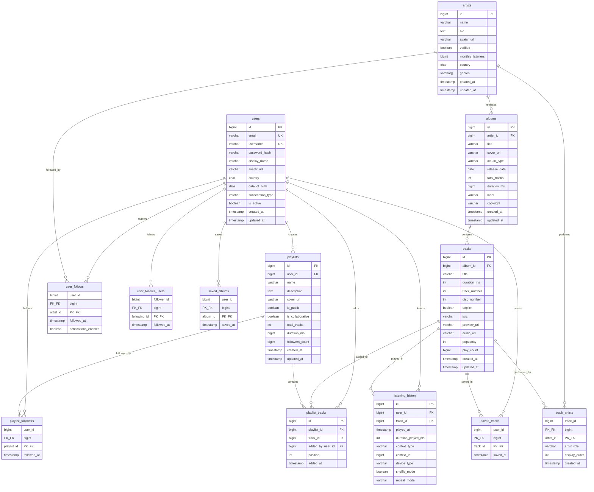

# Spotify-Like Database Schema

A production-ready relational database schema for a music streaming platform, designed for PostgreSQL.

---

## 📊 Entity Relationship Diagram



---

## 📋 Table Descriptions

### Core Entities

| Table     | Purpose                                                                                  |
| --------- | ---------------------------------------------------------------------------------------- |
| `users`   | Stores user account data including authentication, profile info, and subscription status |
| `artists` | Stores artist/band profiles with metadata like bio, genres, and verification status      |
| `albums`  | Stores album information linked to a primary artist                                      |
| `tracks`  | Stores individual songs with audio metadata and playback statistics                      |

### Relationship Tables (Junction Tables)

| Table                | Purpose                                                       | Relationship                    |
| -------------------- | ------------------------------------------------------------- | ------------------------------- |
| `track_artists`      | Links tracks to multiple artists (featured artists, remixers) | Many-to-Many                    |
| `playlist_tracks`    | Links tracks to playlists with ordering                       | Many-to-Many                    |
| `user_follows`       | Links users to artists they follow                            | Many-to-Many                    |
| `user_follows_users` | Links users following other users                             | Many-to-Many (self-referential) |
| `playlist_followers` | Links users to playlists they follow                          | Many-to-Many                    |
| `saved_tracks`       | User's "Liked Songs" library                                  | Many-to-Many                    |
| `saved_albums`       | User's saved albums library                                   | Many-to-Many                    |

### Activity Tables

| Table               | Purpose                                                    |
| ------------------- | ---------------------------------------------------------- |
| `playlists`         | User-created or system-generated playlists                 |
| `listening_history` | Records every track play for analytics and recommendations |

---

## 🔗 Relationship Types

```
┌─────────────────────────────────────────────────────────────────┐
│                    RELATIONSHIP SUMMARY                         │
├─────────────────────────────────────────────────────────────────┤
│                                                                 │
│  ONE-TO-MANY (1:N)                                             │
│  ─────────────────                                             │
│  • users      → playlists         (user creates many playlists)│
│  • artists    → albums            (artist releases many albums)│
│  • albums     → tracks            (album contains many tracks) │
│  • users      → listening_history (user has play history)      │
│                                                                 │
│  MANY-TO-MANY (M:N)                                            │
│  ─────────────────                                             │
│  • tracks    ↔ artists   (via track_artists)                   │
│  • playlists ↔ tracks    (via playlist_tracks)                 │
│  • users     ↔ artists   (via user_follows)                    │
│  • users     ↔ users     (via user_follows_users)              │
│  • users     ↔ playlists (via playlist_followers)              │
│  • users     ↔ tracks    (via saved_tracks)                    │
│  • users     ↔ albums    (via saved_albums)                    │
│                                                                 │
└─────────────────────────────────────────────────────────────────┘
```

---

## 📑 Index Strategy

### Why These Indexes?

| Index                               | Table             | Purpose                                   |
| ----------------------------------- | ----------------- | ----------------------------------------- |
| `idx_users_email`                   | users             | Fast login authentication lookups         |
| `idx_users_username`                | users             | Username search and profile lookups       |
| `idx_artists_name`                  | artists           | Artist search functionality               |
| `idx_artists_name_trgm`             | artists           | Fuzzy/typo-tolerant artist search         |
| `idx_artists_monthly_listeners`     | artists           | Sort artists by popularity                |
| `idx_albums_artist_id`              | albums            | Fetch all albums by an artist             |
| `idx_albums_release_date`           | albums            | "New Releases" feature                    |
| `idx_albums_artist_release`         | albums            | Artist discography sorted by date         |
| `idx_tracks_album_id`               | tracks            | Fetch all tracks in an album              |
| `idx_tracks_popularity`             | tracks            | Charts and trending tracks                |
| `idx_tracks_title_trgm`             | tracks            | Fuzzy track title search                  |
| `idx_tracks_album_order`            | tracks            | Display album track list in order         |
| `idx_track_artists_artist_id`       | track_artists     | Find all tracks by an artist              |
| `idx_playlists_user_id`             | playlists         | User's playlist library                   |
| `idx_playlists_public`              | playlists         | Discover public playlists                 |
| `idx_playlist_tracks_playlist_pos`  | playlist_tracks   | Ordered playlist track listing            |
| `idx_listening_history_user_recent` | listening_history | "Recently Played" feature                 |
| `idx_listening_history_track_id`    | listening_history | Track play count analytics                |
| `idx_listening_history_played_at`   | listening_history | Time-based charts (daily/weekly)          |
| `idx_saved_tracks_user_recent`      | saved_tracks      | User's "Liked Songs" ordered by save date |

### Index Categories

1. **Search Indexes** - Enable fast text search on names/titles
2. **Foreign Key Indexes** - Speed up JOIN operations
3. **Sort Indexes** - Optimize ORDER BY queries (popularity, date)
4. **Composite Indexes** - Cover common multi-column queries
5. **Partial Indexes** - Index only relevant rows (e.g., `WHERE is_public = TRUE`)

---

## 🏗️ Design Decisions

### 1. **Separate `track_artists` Table**

Instead of storing a single `artist_id` on tracks, we use a junction table to support:

- Featured artists
- Collaborations
- Remixers
- Display ordering

### 2. **`listening_history` Context Tracking**

We store `context_type` and `context_id` to know WHERE a track was played from:

- From an album? → `context_type='album'`, `context_id=album_id`
- From a playlist? → `context_type='playlist'`, `context_id=playlist_id`
- From search? → `context_type='search'`

### 3. **Denormalized Counters**

Fields like `total_tracks`, `followers_count`, and `play_count` are denormalized for performance. These should be updated via triggers or background jobs.

### 4. **Soft Delete Strategy**

We use `is_active` on users rather than hard deletes to preserve referential integrity and enable account recovery.

### 5. **PostgreSQL-Specific Features**

- `BIGSERIAL` for auto-incrementing IDs
- `VARCHAR[]` arrays for genres
- `gin_trgm_ops` for fuzzy text search
- `TIMESTAMP WITH TIME ZONE` for global consistency

---

## 📈 Common Query Patterns

### Get User's Recently Played

```sql
SELECT t.*, a.title as album_title, ar.name as artist_name
FROM listening_history lh
JOIN tracks t ON t.id = lh.track_id
JOIN albums a ON a.id = t.album_id
JOIN artists ar ON ar.id = a.artist_id
WHERE lh.user_id = ?
ORDER BY lh.played_at DESC
LIMIT 50;
```

### Get Playlist with Tracks

```sql
SELECT p.*, t.*, ar.name as artist_name
FROM playlists p
JOIN playlist_tracks pt ON pt.playlist_id = p.id
JOIN tracks t ON t.id = pt.track_id
JOIN track_artists ta ON ta.track_id = t.id AND ta.artist_role = 'primary'
JOIN artists ar ON ar.id = ta.artist_id
WHERE p.id = ?
ORDER BY pt.position;
```

### Get Artist's Top Tracks

```sql
SELECT t.*, a.title as album_title
FROM tracks t
JOIN track_artists ta ON ta.track_id = t.id
JOIN albums a ON a.id = t.album_id
WHERE ta.artist_id = ?
ORDER BY t.popularity DESC
LIMIT 10;
```

### Search Across All Entities

```sql
-- Artists matching query
SELECT 'artist' as type, id, name as title FROM artists
WHERE name ILIKE '%query%' LIMIT 5;

-- Albums matching query
SELECT 'album' as type, id, title FROM albums
WHERE title ILIKE '%query%' LIMIT 5;

-- Tracks matching query
SELECT 'track' as type, id, title FROM tracks
WHERE title ILIKE '%query%' LIMIT 5;
```

---

## 🔧 Maintenance Recommendations

1. **Partition `listening_history`** by month for better performance at scale
2. **Archive old history** data to a separate table after 2+ years
3. **Use connection pooling** (PgBouncer) for high-concurrency workloads
4. **Set up read replicas** for analytics queries
5. **Schedule `VACUUM ANALYZE`** during off-peak hours
6. **Monitor slow queries** and add indexes as needed
